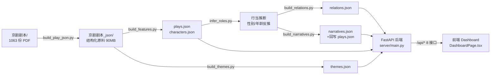
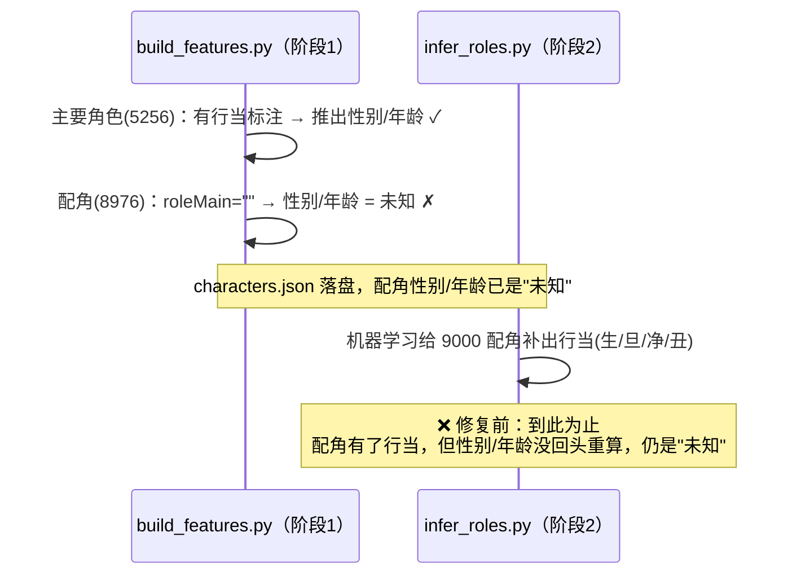
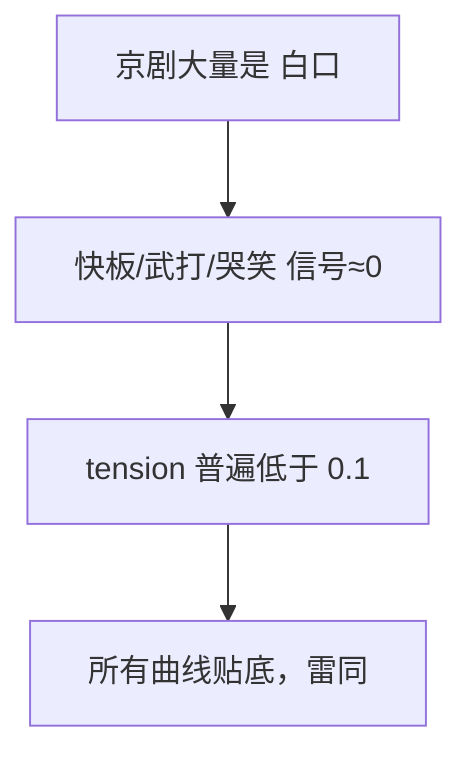
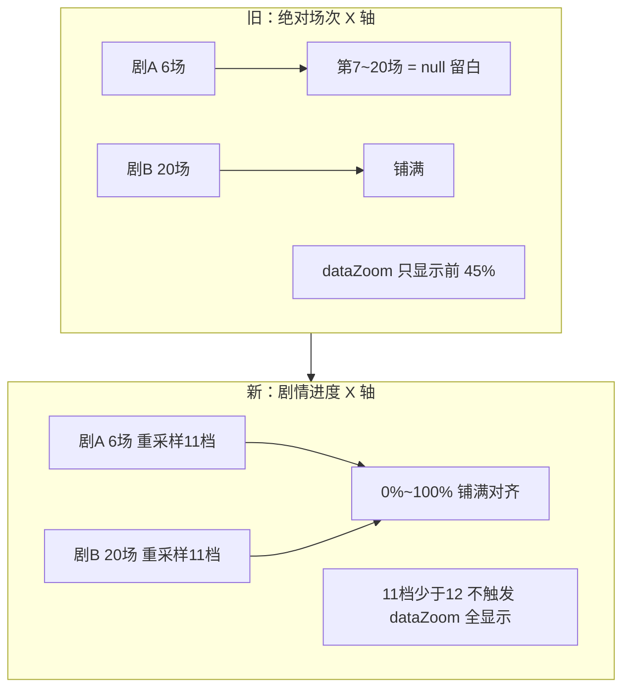
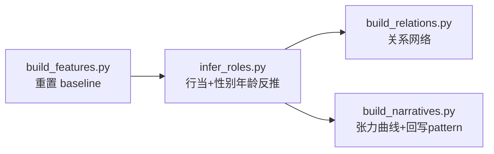

# 京剧可视化系统 — 数据与可视化问题修复说明

> 本文记录一轮针对**数据质量**与**可视化呈现**的问题排查与修复。
> 每个问题包含：现象 → 原因分析（含代码/数据证据）→ 解决方案 → 为什么这样解决 → 与之前的区别。

---

## 0. 背景：数据管线三层架构

系统的数据是**预先批量算好**的（后端不实时重算，只做过滤聚合），分三层：



**关键认知**：`build_features.py` 与 `infer_roles.py` 有**先后顺序依赖**——很多问题的根源就在这个顺序上。

本轮共修复 6 个问题，分属数据 / 后端 / 前端三层：

| 编号 | 问题 | 所属层 |
| --- | --- | --- |
| 一 | 角色桑基图大量"未知" | 数据层 |
| 二 | 叙事曲线雷同（都像平线） | 数据层 |
| 三 | 部分剧本图谱空白（"没联动"） | 数据层 |
| 四 | 叙事曲线图只显示部分区间 / 区间里没线 | 前端层 |
| 五 | 切换剧目时图表显示旧剧目、不更新 | 前端层 |
| 六 | 选单剧目时叙事/散点退化成一条线 / 一个点 | 后端 + 前端 |

---

## 问题一：角色桑基图大量"未知"

### 现象

「角色特征与行当图」桑基图里，**性别**层和**年龄**层各有一大块灰色「未知」，占了一多半，图很难看也无分析价值。

- gender：未知 **8464** / 男 4218 / 女 1550
- ageGroup：未知 **8822** / 中年 2744 / 老年 1438 / …

### 原因分析

性别/年龄是在 `build_features.py` 里用**启发式规则**算的，规则**强依赖行当**：

```python
# build_features.py
def infer_gender(name, role_main, role_subtype):
    if role_main == "旦":
        return "女"
    ...
    if role_main in ("生", "净", "丑"):
        return "男"
    return "未知"          # ← 行当为空 → 落到这里
```

但问题在**处理顺序**：性别/年龄在 `build_features` 阶段就算了，而那时**配角还没有行当**——行当是后一步 `infer_roles.py` 才用机器学习补的。



> 一句话：**配角的行当后来补上了，但性别/年龄没有跟着重算**，白白浪费了推断出的行当信息。

### 解决方案

在 `infer_roles.py` 末尾（行当全部补完之后）**反推一次性别/年龄**，只填补仍是"未知"的，绝不覆盖已判定的：

```python
# infer_roles.py（新增）
from build_features import infer_gender, infer_age   # 复用同一套规则

for c in chars:
    if c.get("gender") == "未知":
        g = infer_gender(c["name"], c.get("roleMain", ""), c.get("roleSubtype", ""))
        if g != "未知":
            c["gender"] = g
    if c.get("ageGroup") == "未知":
        a = infer_age(c["name"], c.get("roleMain", ""), c.get("roleSubtype", ""))
        if a != "未知":
            c["ageGroup"] = a
```

### 为什么这样解决

- **复用同一套规则**（`infer_gender`/`infer_age`），不引入新逻辑，保证主要角色与配角口径一致。
- **只填"未知"、不覆盖已判定**：主要角色原本算对的值不受影响，行为保守可预测。
- **放在 `infer_roles` 末尾**：此时行当已补全，是反推性别/年龄的最早可用时机。

### 与之前的区别

| | 修复前 | 修复后 |
| --- | --- | --- |
| 处理顺序 | 性别/年龄只在 `build_features` 算一次（配角无行当） | `infer_roles` 补完行当后**再反推一次** |
| gender 未知 | 8464 | **0**（男 11976 / 女 2256） |
| ageGroup 未知 | 8822 | **0**（中年 11032 / 老年 1478 / …） |

**代价（诚实交代）**：配角大量落到"男 / 中年"默认值（行当→生/净/丑默认男；判不出年龄默认中年）。这是**兜底默认**，比"未知"好、分析上也站得住（男性+中年确实是京剧主体），但要清楚其中有默认成分。更精确需 LLM 逐角色判断。

---

## 问题二：叙事曲线雷同（都像平线）

### 现象

很多剧本的叙事张力曲线**长得完全一样**，都像贴着底部的平线，无法区分。

### 原因分析

旧的 tension 公式：

```python
# build_narratives.py（旧）
action  = (n_fast + n_stage_act) / n_total      # 快板类 + 武打舞台关键词
emotion = (n_emo_act + n_stage_emo) / n_total   # 哭笑类
tension = 0.55 * action + 0.30 * emotion + 0.15 * min(角色数 / 8, 1.0)
```

问题：`action`/`emotion` 的信号来源（快板、武打关键词、哭笑）在京剧里**很稀疏**——**绝大多数台词是"白"**。于是大多数场次 action≈0、emotion≈0，tension 退化成只剩角色数那一项的微小值。

**数据证据**（修复前）：

| 指标 | 值 |
| --- | --- |
| tension 最大值 | 0.55 |
| tension **平均值** | **0.093** |
| tension > 0.3 的场次占比 | 1% |

→ 99% 的场次 tension 都挤在 **0~0.1** 的狭窄区间，所有曲线贴着坐标底部，肉眼无法区分。



### 解决方案

两步改造（`build_narratives.py`）：

**① 重设计 tension —— 用更普遍存在的多种信号**

```python
# build_narratives.py（新）
sing_ratio       = n_sing / n_total            # 唱念占比（抒情高潮）
action_density   = (n_fast + n_stage_act) / n_total
emotion_density  = (n_emo_act + n_stage_emo) / n_total
dialogue_density = 说话人切换次数 / n_total      # 对话越频繁越紧张
char_presence    = min(角色数 / 6, 1.0)
scene_weight     = min(本场台词数 / 全剧平均, 2.0) / 2.0   # 戏份重的场

raw_tension = (0.28*action_density + 0.22*emotion_density + 0.20*sing_ratio
             + 0.15*dialogue_density + 0.10*char_presence + 0.05*scene_weight)
```

**② 每个剧本内部 min-max 归一化到 [0.1, 1.0]**

```python
def normalize_curve(raws):
    lo, hi = min(raws), max(raws)
    if hi - lo < 1e-9:
        return [0.5] * len(raws)          # 完全平的剧 → 中线
    return [round(0.1 + 0.9 * (r - lo) / (hi - lo), 4) for r in raws]
```

### 为什么这样解决

- **多信号**：唱念比例、对话切换在**每个剧本都大量存在**，不像"武打"那样稀疏，因此每场都能拿到有区分度的值。
- **每剧内部归一化**是关键：它让每条曲线在**自己的尺度**上充分起伏（最低 0.1、最高 1.0），而不是全部压在一个全局低位区间。叙事分析关心的本就是**单剧内部的相对起伏**（哪一场是高潮），不是跨剧绝对值，所以按剧归一化恰好对路。

### 与之前的区别

| | 修复前 | 修复后 |
| --- | --- | --- |
| 信号 | 仅 action/emotion（稀疏） | +唱念比例 +对话切换 +场次规模（普遍） |
| 标度 | 全局绝对值，普遍 < 0.1 | **每剧归一化到 [0.1, 1.0]** |
| tension 均值 | 0.093 | **0.612** |
| 每剧曲线波动(std) | ≈0（平） | **0.316（明显起伏）** |
| 样例（空城计） | 一条贴底平线 | `[0.9, 0.1, 0.1, 1.0, 0.52, 0.35]` |

---

## 问题三：部分剧本图谱空白（"没联动"）

点开某些剧本，叙事曲线或关系图是空的。拆开后是**两个独立原因**：

### 3.1 折子戏没有叙事曲线（179 个）

**原因**：叙事曲线以【第N场】为单位，但 179 个折子戏（如很多昆曲折子）**没有【第N场】结构**，旧代码遇到无场次直接跳过 → 无曲线。

```python
# build_narratives.py（旧）
scenes = [s for s in scenes if s["sceneNum"] > 0]
if not scenes:
    per_play_curves[pid] = []
    continue            # ← 折子戏直接被跳过，无曲线
```

**解决方案**：无【第N场】时，把台词序列**等分成 K 段**当虚拟场次（每段当一"场"）：

```python
def synthetic_scenes(lines):
    n = len(lines)
    K = max(3, min(8, n // 20))      # 3~8 段
    seg = max(1, n // K)
    # 每段聚合出 characters / actions，当作一个 pseudo-scene
    ...
```

**为什么这样解决**：折子戏虽无显式分场，但台词是**线性推进**的，按顺序等分能近似还原"开端→发展→高潮→收尾"的节奏，让这些剧本也能进入叙事分析。

**效果**：无叙事曲线剧本 **179 → 1**（仅剩 1 个空 PDF）。

### 3.2 独角戏没有关系边（11 个）

**数据证据**（诊断这 11 个剧本）：

| 剧本 | 实际情况 |
| --- | --- |
| 《林冲夜奔》 | 林冲一人 23 句独唱 |
| 《牡丹亭·拾画》 | 柳梦梅独角 |
| 《宝剑记·夜奔》 | 林冲独角 |
| 《鸿雁捎书》 | 王宝钏独角 |

**结论**：这些是**独角折子戏**——台上**就一个人**，**本就没有角色关系**。关系图为空是**正确的**，强行造边反而是错的。

> 关系网络的逻辑（同场≥2 角色才连边）本身没问题，这 11 个是数据的真实特征，不是 bug。

```python
# build_relations.py（仅加注释说明，逻辑不变）
# 无边的是独角戏(林冲夜奔/牡丹亭·拾画…)，本就无角色关系，空图正确。
# 前端应显示"独角戏"空状态，而非空白图。
```

**待办（前端）**：对这类剧本显示"本剧为独角戏，无角色关系网络"提示，而非空白图。

---

## 问题四：叙事曲线图只显示部分区间 / 区间里没线

> ⚠️ 这是**前端图表配置**问题，与数据层无关——问题二的数据修复解决不了它。

### 现象

叙事曲线图只展示 X 轴的一部分区间，且区间里有时**没有线**。

### 原因分析

根因有**两个，叠加**（均在 `DashboardPage.tsx`）：

**根因 A — `dataZoom` 默认只显示前 45%**

```tsx
// createLineOption（旧）
dataZoom: normalizedPayload.xLabels.length > 12
  ? [{ type: 'inside', start: 0, end: 45 }]   // ← 只显示 X 轴 0~45%
  : []
```

**根因 B — X 轴用"绝对场次"并集 → 短剧本右侧留白**

```tsx
// buildNarrativesChart（旧）
const xLabels = unique(tensionSeries.map(i => i.scene))   // "第1场".."第20场" 并集
...
data: xLabels.map(scene => ({
  value: pointMap.get(`${playId}::${scene}`)?.tension ?? null   // ← 没有该场 = null
}))
```

X 轴被**最长的剧本**撑到 20+ 场，一个只有 6 场的剧本在"第7场~第20场"全是 `null`，那一段**没有线**。



### 解决方案

把 X 轴从"绝对场次"改成"**剧情进度 0%→100%**"，每个剧本**重采样到统一 11 档**（线性插值）：

```tsx
// buildNarrativesChart（新）
const STEPS = 11   // 0%, 10%, … 100%
const xLabels = Array.from({length: STEPS}, (_, i) => `${Math.round(i/(STEPS-1)*100)}%`)

series: playIds.map(playId => {
  const points = byPlay.get(playId).sort((a,b)=>getSceneOrder(a.scene)-getSceneOrder(b.scene))
  const resampled = resampleTension(points.map(p => p.tension), STEPS)   // 插值到11档
  return { ..., data: resampled.map((value,i)=>({ x: xLabels[i], value })) }
})
```

### 为什么这样解决

- **进度对齐**：不论剧本几场，都铺满 0%→100%，**没有 null 留白**，且不同剧本可对齐比较。
- **顺带关掉 dataZoom**：11 档 < 12，`xLabels.length > 12` 判断为假，**自动不再启用** `start:0,end:45` 的缩放限制 → **全显示**。一处改动解决两个根因。
- **复用现成工具**：另一分支 `aggregateNormalizedLineSeriesByGroup` 本就用 `buildNormalizedAxis(11)`——队友其实已写好归一化轴工具，只是这个图当初没接上，现在补齐，两条代码路径口径一致。

### 与之前的区别

| | 修复前 | 修复后 |
| --- | --- | --- |
| X 轴含义 | 绝对场次（第1场…第N场） | **剧情进度 0%→100%** |
| 不同长度剧本 | 短剧右侧 `null` 留白 | 重采样 11 档，**铺满对齐** |
| 默认可视范围 | 仅前 45%（dataZoom） | **全显示**（11<12 不触发） |
| 副标题 | "…在场次上的变化" | "按剧情进度（0→100%）…" |

---

## 问题五：切换剧目时图表显示旧剧目、不更新

> 前端层问题。

### 现象

顶部「剧目」下拉换了剧目，但叙事曲线等图仍显示**上一个剧目**的线，连换几个剧目都不变。

### 原因分析

`ChartPanel` 渲染 ECharts 时没设 `notMerge`，echarts-for-react 默认**增量合并**：新数据若比旧的少（如从 6 条线变 1 条），旧的多余 series 不会被清除，残留在图上。

### 解决方案

两处 ReactECharts 加 `notMerge`，每次完全重建：

```tsx
<ReactECharts option={option} notMerge ... />
```

### 与之前的区别

| | 修复前 | 修复后 |
| --- | --- | --- |
| 切换剧目 | 残留旧剧目的线 | 完全替换为新剧目 |
| 影响范围 | **所有** series 数量变化的图 | 全部正常 |

> 这个 bug 影响所有图表，叙事图最明显（线数量变化最大）。

---

## 问题六：选单剧目时叙事曲线 / 散点图退化成"一条线 / 一个点"

> 前后端配合，用新增可选字段 `focusPlayId`。

### 现象

选了某个剧目后：
- 叙事曲线只剩**一条线**，但标题写"对照各剧目"——无从对照
- 跨任务综合图（散点）只剩**一个点**——看不出剧目相似性

> 这个矛盾此前被问题五的残留 bug 掩盖，修掉 `notMerge` 后才显现。

### 原因分析

`playId` 是全局筛选，所有接口按它收窄到单剧。但叙事曲线、散点图本是"对照型"视图，被收窄成单条/单点就失去了分析意义。

### 解决方案


- **叙事曲线**：后端选剧目时返回「该剧 + 同 `narrativePattern` 的 5 个对照剧目」+ `focusPlayId`；前端把该剧画成粗亮线、对照画成细灰线
- **散点图**：后端返回背景分布（忽略 `playId` 的同筛选集）+ `focusPlayId`；前端把该剧放大成高亮红点、其他点淡化

### 为什么这样解决

- 用**新增可选字段** `focusPlayId`，不改任何现有字段名 → 不破坏前后端契约
- 无 `focusPlayId` 时前端**完全回退原行为** → 向后兼容
- "对照"语义重新成立：能看该剧在同类剧目中的相对位置

### 与之前的区别

| | 修复前 | 修复后 |
| --- | --- | --- |
| 选剧目 · 叙事曲线 | 孤零零一条线 | 该剧高亮 + 5 条同模式对照 |
| 选剧目 · 散点图 | 一个点 | 全局背景 + 高亮该剧 |

---

## 修复效果汇总

| 问题 | 关键指标 | 修复前 → 修复后 |
| --- | --- | --- |
| 一 桑基图未知 | gender 未知 | 8464 → **0** |
| 一 桑基图未知 | ageGroup 未知 | 8822 → **0** |
| 二 曲线雷同 | tension 均值 | 0.093 → **0.612** |
| 二 曲线雷同 | 每剧曲线波动 std | ≈0 → **0.316** |
| 三 折子戏无曲线 | 无叙事曲线剧本数 | 179 → **1**（空 PDF） |
| 三 独角戏无边 | 11 个 | 确认正确，无需改数据 |
| 四 曲线图区间 | X 轴可视范围 | 前 45% / 有留白 → **全显示 / 无留白** |
| 五 切换不更新 | 换剧目残留旧线 | 残留 → **完全替换** |
| 六 单剧退化 | 选剧目·叙事/散点 | 一条线 / 一个点 → **高亮该剧 + 对照背景** |

---

## 影响的文件

**数据层（脚本 + 重跑产物）**

| 文件 | 改动 |
| --- | --- |
| `scripts/infer_roles.py` | 新增：补完行当后反推性别/年龄 |
| `scripts/build_narratives.py` | 重写：tension 多信号公式 + 每剧归一化 + 折子戏虚拟分段 |
| `scripts/build_relations.py` | 注释：说明独角戏无边为正确 |
| `data/characters.json` | 性别/年龄补全 |
| `data/narratives.json` | 新的张力曲线 |
| `data/plays.json` | narrativePattern 随新曲线更新 |

**后端层**

| 文件 | 改动 |
| --- | --- |
| `server/main.py` | `/api/narratives` 选剧目时返回同模式对照组；`/api/associations` 散点返回背景分布；两者新增 `focusPlayId` |

**前端层**

| 文件 | 改动 |
| --- | --- |
| `src/api/types.ts` | `NarrativeResponse`、`AssociationResponse` 各加可选字段 `focusPlayId?`（契约扩展，向后兼容） |
| `src/components/ChartPanel.tsx` | 两处 ReactECharts 加 `notMerge`（bug 修复） |
| `src/pages/DashboardPage.tsx` | `buildNarrativesChart` 剧情进度轴；`build/createLine/Scatter` 系列叠加 focus 高亮；副标题动态 |

---

## ⚠️ 前端改动的协作说明

本轮修复中**问题四、五、六**涉及前端实现文件（`ChartPanel.tsx`、`DashboardPage.tsx`），按"后端不改前端"的分工，这部分需前端同学知情/复核。说明如下：

| 检查项 | 结论 |
| --- | --- |
| 是否改了 API 字段名 | ❌ 没有。`types.ts` 仅**新增**可选字段 `focusPlayId?` |
| 是否改了组件 props 接口 | ❌ 没有。`ChartPanel` 只多传一个 `notMerge` |
| 是否破坏现有渲染行为 | ❌ 没有。focus 逻辑均为 `hasFocus ? 新 : 原`，不选剧目时与原行为一致 |

**为什么必须动前端**：`focusPlayId` 是后端新增的数据，前端必须消费它才能高亮——"对照高亮"功能本质上需要前后端配合。

**前端同学可自由重写**：后端契约（`focusPlayId` 可选字段）保持不变，前端如何用它渲染高亮（线宽/透明度/散点大小/副标题文案）完全是前端的自由，可按自己的风格重做 `DashboardPage.tsx` 里的 focus 部分，不影响后端。

---

## 重跑数据的正确顺序（重要）

数据层脚本有依赖，**必须按序**跑，否则会出错（曾踩坑：`infer_roles` 若在被污染的 `characters.json` 上重跑，会把上次推断的配角误当训练集）：



> `build_features.py` 会把 `plays.json` 的 `narrativePattern` 清空，所以它后面必须再跑 `build_narratives.py` 把该字段补回。`themes.json` 不依赖这些字段，可不重跑。
